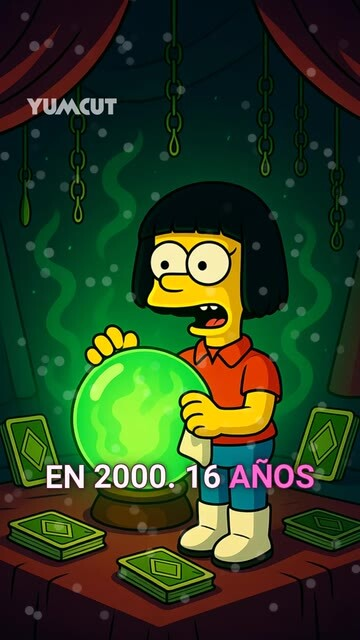

# YumCut

Open-source AI short video generator for TikTok, YouTube Shorts, and Instagram Reels.

[YumCut](https://yumcut.com/?utm_source=github) is a free/self-hosted alternative to closed short-video SaaS tools. It automates the full short-form pipeline:

- prompt to script
- script to voice
- visuals + captions + assembly
- final vertical video export (9:16)

If you are searching for:

- open-source AI short video generator
- free faceless video generator
- Clippie AI alternative
- FacelessReels alternative
- TikTok / Reels / Shorts generator

this repository is built for that.

## Why YumCut

- Open-source and self-hosted: no vendor lock-in, fully auditable code.
- Built for short-form growth workflows: script, voice, visuals, captions, publish-ready outputs.
- Cost control: bring your own providers, run local components where possible, and tune quality/speed trade-offs.
- Production-oriented architecture: separate app + storage modes, signed upload/delete grants, typed API boundaries.

## Cost Positioning

YumCut is positioned as a cost-efficient alternative to premium closed models and platforms.

- High-end proprietary video APIs can be expensive at scale. For example, Google Vertex AI lists Veo 3.0 Fast at `$0.40/sec` output and Veo 3.0 at `$0.75/sec` output.
- At those rates, a single 60s output can cost about `$24` to `$45` before extra tooling.
- With YumCut, teams can often reach order-of-magnitude lower effective cost by combining open/self-hosted pieces plus selective paid APIs.

Expensive closed-model examples teams often compare against:

- Veo (Vertex AI / premium tiers)
- Runway Gen video models
- Pika premium plans
- Luma Dream Machine paid plans
- other closed, credit-based video generation APIs

## Similar Products (and Where YumCut Fits)

Tools that are directly focused on short vertical generation:

- Clippie AI
- Wava AI
- FacelessReels
- Faceless.video
- Revid.ai
- Viralmaxing

Adjacent tools (useful, but different primary use-case):

- Submagic (strong caption/editing workflow)
- Klap (repurposing long-form into shorts)
- Creatify (AI ad creative focus)

YumCut focuses on being the open-source/free analog for end-to-end short vertical generation, not only post-editing.

## Real Videos

Real social links:

<table>
  <tr>
    <td align="center" valign="top">
      
    </td>
    <td align="center" valign="top">
      
    </td>
    <td align="center" valign="top">
      
    </td>
    <td align="center" valign="top">
      
    </td>
    <td align="center" valign="top">
      
    </td>
  </tr>
  <tr>
    <td align="center" valign="top">
      Simpsons Style
       
      YouTube Shorts · 1.5K
    </td>
    <td align="center" valign="top">
      Italian Horror
       
      YouTube Shorts · 1.5K
    </td>
    <td align="center" valign="top">
      Simpsons Spanish
       
      YouTube Shorts · 1.5K
    </td>
    <td align="center" valign="top">
      99 Nights Story
       
      YouTube Shorts · 1.2K
    </td>
    <td align="center" valign="top">
      Bitcoin Story
       
      TikTok · 90K
    </td>
  </tr>
</table>

### Other Videos

Temporary collage script: `scripts/tmp/build-video-collage.sh`

## Technical Documentation

Technical setup and implementation details were moved to [docs/tech.md](docs/tech.md).

## Free Clippie AI Alternative

If you are looking for a free Clippie AI alternative, YumCut is designed as an open-source path for similar short-form workflows:

- faceless-style vertical content generation
- automated script + voice + visual assembly
- export-ready TikTok / Reels / Shorts output
- self-hosted deployment with your own infra and provider choices

Related search intents this project targets:

- free Clippie AI alternative
- open-source FacelessReels alternative
- free faceless.video alternative
- open-source short video generator
